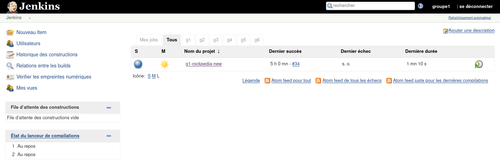

# Rockpedia : Bien collaborer

## Swagger

Swagger est la documentation de l'application. Elle est accessible en local à l'adresse [http://localhost:8080/swagger-ui.html](http://localhost:8080/swagger-ui.html) et en ligne : [https://groupe1.m2gi.win/swagger-ui.html](https://groupe1.m2gi.win/swagger-ui.html)

## Tests

Les tests sont primordiaux pour s'assurer de la qualité du code. Il en existe deux types :

- ### Les tests <u>unitaires</u>

Les tests unitaires sont chargés de s'assurer que le résultat d'une fonction retourne toujours exactement le même résultat pour une même entrée. Cela permet aussi de vérifier, après modification, que toutes les fonctions existantes apparavant ne sont pas compromises et fonctionnent correctement (tests de non-régression).

Ces tests servent surtout à vérifier si la logique de l'application retourne les résultats escontés, dans notre cas, la fonction de scoring pour le tri des résultats de recherche (`SearchBand.matchScore()`)

- ### Les test <u>d'intégration</u>

Les tests d'intégration servent à s'assurer que les résultats sont envoyés et sous la bonne forme (bon encodage par exemple, pour éviter les Ã, ©...) pour une entrée donnée.

Dans ce cas, on va plutôt tester que le controleur (`BandController`) renvoye les bons résultats sous la bonne forme.

## Jenkins

Pour éviter les phrases du type "...mais ça fonctionne sur ma machine", on fait de l'intégration continue : On fait compiler le code sur une machine autre que les postes depuis le dépot Git.

Cela permet à tous les collaborateurs de voir que les tests ne passent plus à partir de ce commit, et donc de corriger plus vite les bugs.

### Lancer un build Jenkins

- Rendez vous à l'adresse [https://jenkins.m2gi.win/](https://jenkins.m2gi.win/)

- Connectez vous. Si tout se passe bien, vous devriez arriver sur un écran comme celui-ci :

  

- Cliquez sur le nom du projet

- Cliquez sur lancer un build

- Vous devriez voir que quelque chose a démarré. Cliquez sur le #nombre à côté du point clignotant.

- Cliquez sur Console Output pour voir le déroulement du build

Si un build ne passe pas, il faut vérifier en local que le build s'effectue correctement : `mvn install`

## SonarQube

Une application bien conçue ne doit pas comporter de bugs, être bien testée (bonne couverture de code), avoir peu de redondance de code, et respecter les standards le plus possible. SonarQube permet de surveiller tout cela, et en particulier deux choses :

- la couverture de code : c'est le pourcentage de code qui est testé
- la dette technique : c'est le temps nécessaire pour corriger les bugs, failles, redondances...

### Accéder à SonarQube

- Rendez vous à l'adresse [https://sonarqube.m2gi.win/dashboard?id=com.example%3Arockpedia](https://sonarqube.m2gi.win/dashboard?id=com.example%3Arockpedia)
- Vous arrivez sur le tableau de bord de l'application

- On peut distinguer les bugs, les failles de sécurités, la dette technique, la couverture de code et afficher le détail de chacun.

### SonarQube en local, dans l'IDE

Il existe un plugin pour Eclipse, Intellij, VS Code pour surveiller la qualité du code en local : SonarLint

