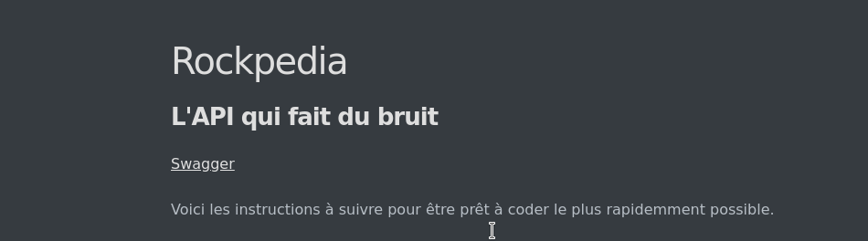

# Rockpedia : l'API qui fait du bruit

[Swagger](/swagger-ui.html)

Voici les instructions à suivre pour être prêt à coder le plus rapidemment possible.

 		<u>1. Prérequis</u>
 		<u>2. Démarrer l'application</u>
 		<u>3. Lancer un build Jenkins</u>
 		<u>4. Analyse SonarQube</u>

## 1. Prérequis

Vous aurez besoin des outils suivants :

- Maven (v3.6.3 ou +)
- JDK8
- Git
- un IDE (nous conseillons Intellij si possible)
- un compte Github (pour pouvoir commit)
- un compte sur la plateforme Jenkins

## 2. Démarrer

- Clonez le dépot :
> `git clone https://github.com/ALudwig57/Rockpedia`

- Build avec maven
>`mvn build`

- Executez les tests 
>`mvn test`

- Build un package
> `mvn package`

- Démarrez l'application
>`mvn spring-boot:run`

- Rendez vous à l'adresse [http://localhost:8080/](http://localhost:8080) avec un navigateur 

Vous devriez voir apparaître cette page :

## 3. Lancer un build Jenkins

- Rendez vous à l'adresse [https://jenkins.m2gi.win/](https://jenkins.m2gi.win/)

- Connectez vous. Si tout se passe bien, vous devriez arriver sur un écran comme celui-ci :

  

- Cliquez sur le nom du projet
- Cliquez sur lancer un build
- Vous devriez voir que quelque chose a démarré. Cliquez sur le #nombre à côté du point clignotant.
- Cliquez sur Console Output pour voir le déroulement du build
- Une fois le build terminé avec succès, passez à l'étape suivante

  ## 4. Analyse SonarQube

- Rendez vous à l'adresse [https://sonarqube.m2gi.win/dashboard?id=com.example%3Arockpedia](https://sonarqube.m2gi.win/dashboard?id=com.example%3Arockpedia)
- Vous arrivez sur le tableau de bord de l'application

- On peut distinguer les bugs, les failles de sécurités, la dette technique, la couverture de code...

Quelque trucs à faire :

-  pre commit hooks
-  git flow
-  Spring actuator : health
-  Sring actuator : infos
-  Spring boot admin
-  Tests intégration, unitaire, smoke tests, ...
-  Checkstyle (avec maven)
-  Autre goals maven d’analyse
-  Guides pour ajouter un endpoint health/info/configurer spring boot admin
-  Findbugs sur Eclipse (et comment l’installer)
-  Outils github (et leur manuel)
-  Pull request
-  Cucumber & Mockito pour le DDD
-  Prometheus pour avoir des métriques sur les méthodes
